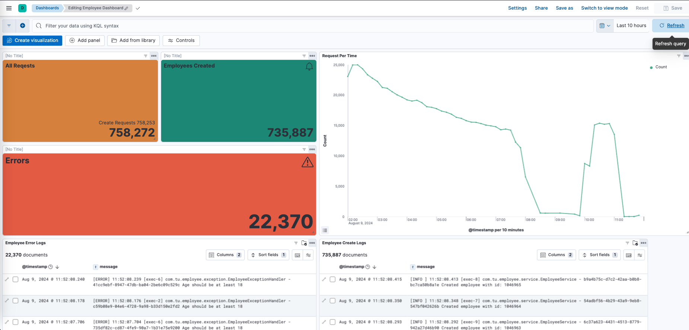
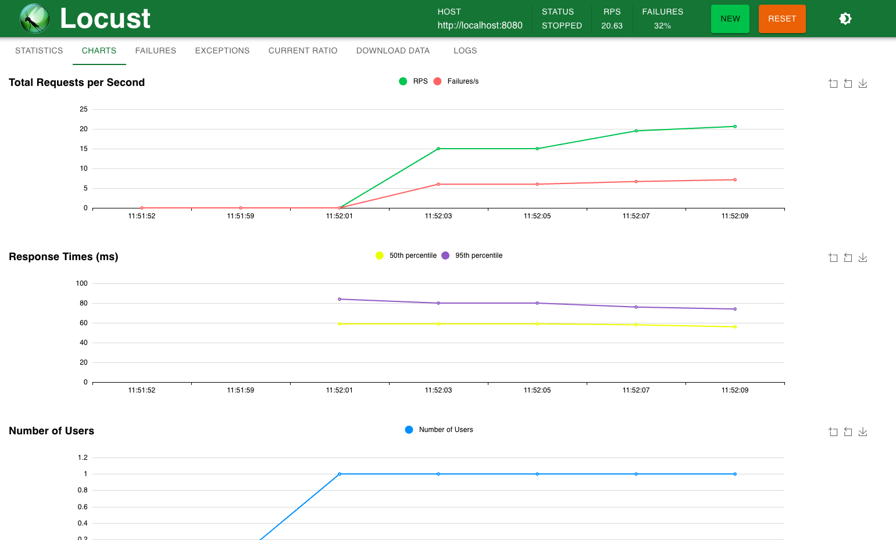

# Employee Service

## Tech Stack
- Java 17
- Springboot
- PostgreSQL
- Junit 5
- Locust (Load Testing)
- ELK (Elastic+Logstash+Kibana - Logging and Dashboards)

## Features
- Create an employee with
    - Name
    - DOB
    - Address
    - Phone Number
    - SIN
    - Title
    - Assign an auto generated employee id upon insertion
- Find all employees
- Search for an employee based on Age and Title
I added some more endpoints while testing the solution like delete, deleteAll, findByPaginated. I can talk about 
them in detail in the interview

## Setup Locally

- Clone https://github.com/bharathrallapalli/tu-challenge.git
- Open Terminal in the root folder and run below command
  - `./mvnw clean install`
  - ` java -jar target/employee-service-1.0.jar`
- If the application is started you should see a response for below command
  - `curl --location 'http://localhost:8080/actuator/health'`
- You can access the swagger to see all the supported endpoints and schema from
http://localhost:8080/swagger-ui/index.html

## Logging and Dashboard

- I have used an opensource ELK distribution
- Application writes logs to a file
- Logstash tails the logs and sends the data to Elasticsearch
- Kibana reads the data from Elasticsearch, I created a simple dashboard using the log data to show number of create 
  requests and failures
- 

## Load Test
- Install locust from https://docs.locust.io/en/stable/installation.html
- Open Terminal in the project root folder and run
  - `locust --host="http://localhost:8080"`
- You should see below console message if locust starts successfully
  - ```
    [2024-08-09 11:50:33,208] Bharaths-MBP-2/INFO/locust.main: Starting web interface at http://0.0.0.0:8089
    [2024-08-09 11:50:33,223] Bharaths-MBP-2/INFO/locust.main: Starting Locust 2.31.2
    ```
- Access locust web UI to start the test http://0.0.0.0:8089
- Locust chart after test
    